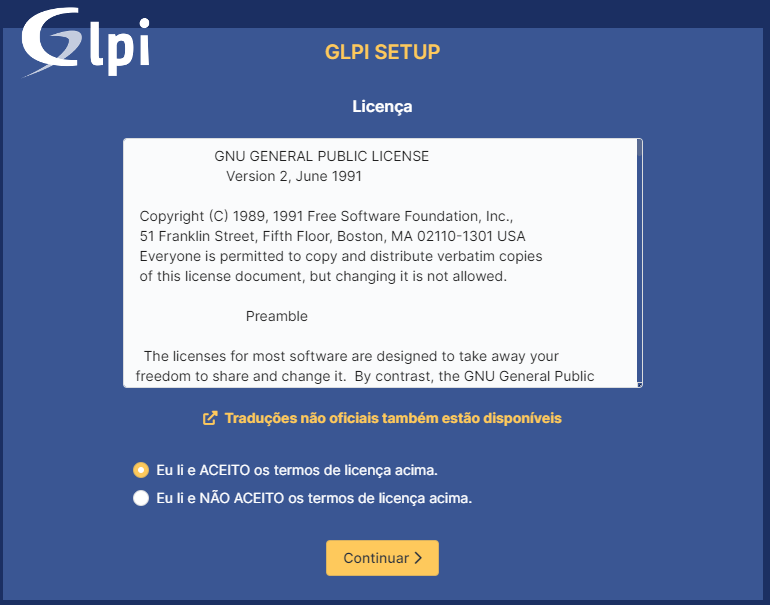
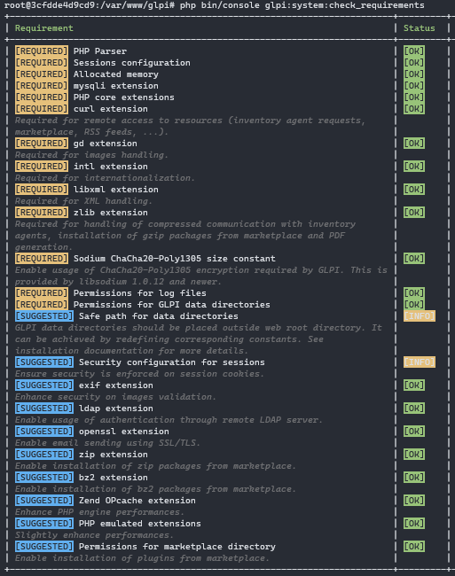

# GLPI 10 Docker Image Template (1.0)

Docker Image with php 7.4, apache 2, mysql 5.7, and glpi 10

## Documentação Oficial

* [Documentação de Instalação](https://glpi-install.readthedocs.io/en/latest/)
* [Documentação de Usuário](https://glpi-user-documentation.readthedocs.io/fr/latest/)

## Configurando o Ambiente de Desenvolvimento

Clone o repositório do projeto

```
git clone git@github.com:JoshuaWebDev/glpi10-docker-image.git
```

Acesse o diretório do projeto

```
cd glpi10-docker-image
```

Copie o arquivo **.env.example** renomeando-o para **.env** e altere o valor das variáveis de acordo com as credenciais da sua base de dados (usuário, senha, porta, etc).

```
cp .env.example .env
```

Execute o comando

```
docker-compose up -d
```

## Instalando o GLPI pelo Navegador

Faça o download do GLPI (versão 10) no [site oficial](https://glpi10.com.br/). Descompacte o conteúdo do arquivo baixado e copie-o para dentro da pasta **glpi10** do projeto.

Com o container up e o GLPI devidamente copiado para a pasta **glpi10** acesse ```localhost:8080```. Aparecerá a tela a seguir. Selecione o idioma e clique em **OK**.


Em seguida a próxima tela solicita que você confirme com os termos da licença para prosseguir com a instalação. Selecione a opção **Eu li e aceito os termos da licença acima** e clique em **Continuar**



Em seguida a próxima tela exibe a opção de **Instalar** ou **Atualizar** o GLPI. Clique em Instalar.


A próxima tela exibe um *check-list* das bibliotecas necessárias para que a instalação ocorra com sucesso. Se estiver tudo ok clique em **Continuar**.


Na próxima tela informe o endereço do servidor de banco de dados. Se estiver usando container, informe o nome do container. Se estiver usando um servidor externo informe o endereço do servidor.

> **Observação: Por questões de segurança é interessante alterar a senha e usuários para uma senha mais forte e um nome de usuário não tão genérico, como glpi ou mysql.**


Em seguida informe o nome da base de dados ou selecione uma base de dados caso já exista.


Se tudo ocorrer bem será exibida a tela a seguir. Clique em **Continuar**.


Na próxima tela você pode optar por enviar informações para o site de telemetria da GLPI para corrigir possíveis bugs e melhorar a aplicação. Essa ação não é obrigatória, caso não queira é só não marcar a opção e clicar em **Continuar**.


A próxima tela exibe mais algumas informações úteis, após lê-las clique em **Continuar**.


A tela seguinte exibe informações sobre usuários e senhas criados por padrão no momento da instalação. Você pode (e deve) criar novos usuários e senhas mais seguras para evitar acesso indevido por pessoas não autorizadas.


A última tela exibe o formulário de login ao qual você pode entrar usando qualquer umas credenciais exibidas anteriormente. E como recomendado anteriormente, crie outros usuários para acessar o sistema.


## Instalando o GLPI pelo Terminal

Outra alterantiva para instalar o GLPI é por meio da **Command Line Tools** que fornece várias opções de instalação e configuração por meio de comandos no terminal. Para saber mais sobre as opções de instalação pela linha de comando acesse a [documentação oficial](https://glpi-install.readthedocs.io/en/latest/command-line.html#cdline-install)

Acesse o container executando o comando a seguir.

```
docker exec -it glpi10 bash
```

Dentro do container execute o comando a seguir para certificar-se de seu ambiente preenche todos os requisitos necessários para uma instalação bem sucedida.

```
php bin/console glpi:system:check_requirements
```



Para facilitar o processo de instalação por meio do terminal foi criado um script de instalação. Se estiver tudo ok execute o script de instalação.

```
install.sh
```

Também é possível executar o script de instalação sem ser necessário entrar no container, basta executar o comando a seguir.

```
docker exec -it glpi10 bash install.sh
```

## Usuários e Senhas Padrão

Os usuários e senhas padrões são:

- **glpi/glpi** para a conta do usuário administrador
- **tech/tech** para a conta do usuário técnico
- **normal/normal** para a conta do usuário normal
- **post-only/postonly** para a conta do usuário postonly

Você pode excluir ou modificar estes usuários bem como os dados iniciais.